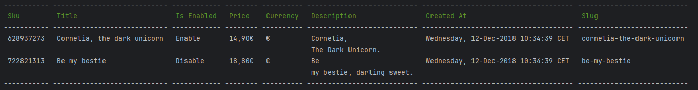
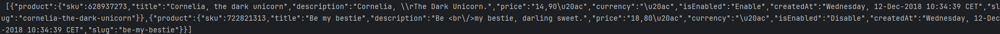

# TestTech Dn'D
This small console application reads a CSV file and displays the report in the console as a table, or a JSON object.

## Getting Started
Consider, our file is here : `public/products.csv`

The command takes as 1st parameter the path to the csv file, so to get the CSV file as a table,
run the following command in the console:
````
php bin/console app:csv-read public/products.csv
````

This will result as :



If you want to get the result as a JSON object, just add `--json` to the command :
````
php bin/console app:csv-read public/products.csv --json
````
Now the result will be :
